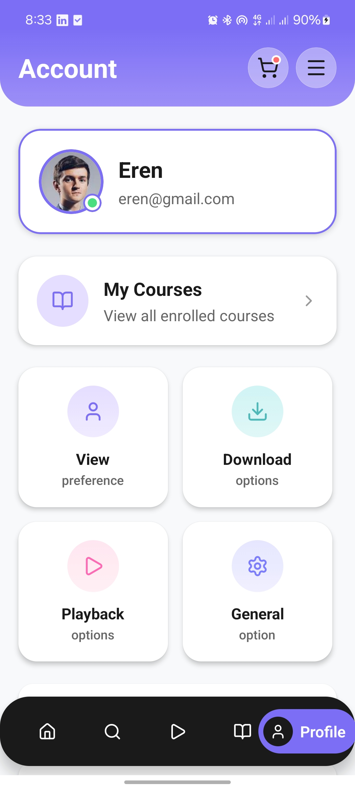
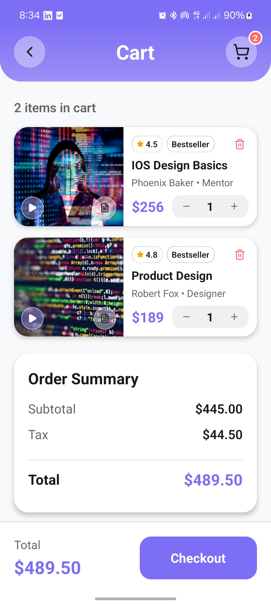
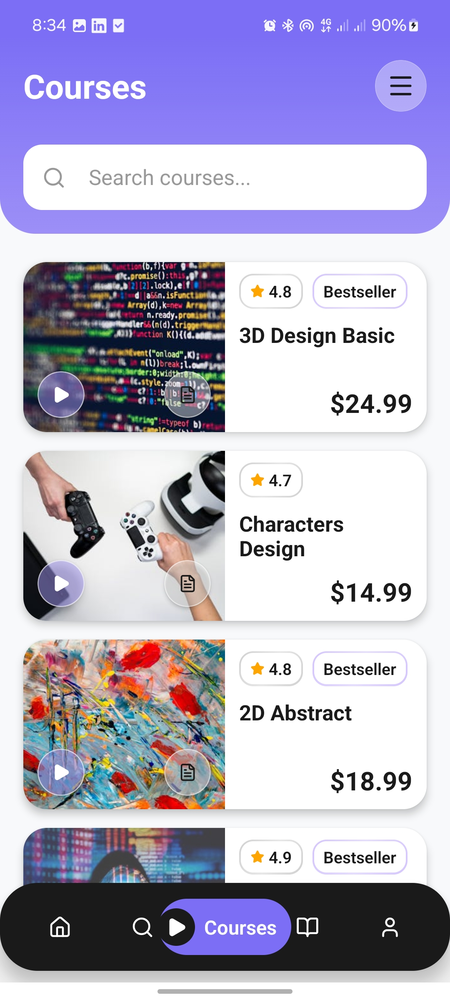

# 📱 Coursia - Course Learning App

A beautiful and modern mobile application for discovering, enrolling, and learning from online courses. Built with React Native and Expo.

## ✨ Features

- 🎓 Browse and discover courses
- 🔍 Advanced search and filtering
- ❤️ Save favorite courses
- 🛒 Shopping cart functionality
- 📚 Track your enrolled courses
- 👤 User profile and settings
- 🔔 Notifications
- 🎨 Beautiful UI with smooth animations
- 🔐 Authentication and onboarding

## 📸 App Screenshots

<div align="center">
  <table>
    <tr>
      <td align="center">
        
        <br />
        <strong>Onboarding</strong>
      </td>
      <td align="center">
        
        <br />
        <strong>User Profile</strong>
      </td>
      <td align="center">
        
        <br />
        <strong>Shopping Cart</strong>
      </td>
    </tr>
    <tr>
      <td align="center">
        
        <br />
        <strong>My Courses</strong>
      </td>
      <td align="center">
        
        <br />
        <strong>Courses</strong>
      </td>
      <td align="center">
        
        <br />
        <strong>Course Details</strong>
      </td>
    </tr>
    <tr>
      <td align="center" colspan="3">
        
        <br />
        <strong>Home & Discover</strong>
      </td>
    </tr>
  </table>
</div>

## 🚀 Getting Started

### Prerequisites

- Node.js (v18 or higher)
- npm or yarn
- Expo CLI
- iOS Simulator (for iOS) or Android Emulator (for Android)

### Installation

1. Clone the repository

```bash
git clone <repository-url>
cd project
```

2. Install dependencies

```bash
npm install
```

3. Start the development server

```bash
npx expo start
```

## 📦 Building

### Android APK

```bash
npx eas-cli build --platform android --profile production
```

### iOS Build

```bash
npx eas-cli build --platform ios --profile production
```

## 🛠️ Tech Stack

- **React Native** - Mobile framework
- **Expo** - Development platform
- **Expo Router** - File-based routing
- **TypeScript** - Type safety
- **NativeWind** - Tailwind CSS for React Native

## 📄 License

This project is private and proprietary.

---

Made with ❤️ using React Native and Expo
